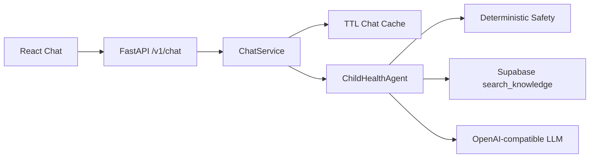

# Dokumentasi Backend Chat Base

Dokumen ini mencatat pekerjaan base backend yang sudah dikerjakan untuk Teman Tumbuh. Fokusnya adalah membuat chat dapat berkomunikasi dengan backend, menghubungkan provider, dan mengurangi request model yang tidak perlu. Infrastruktur agent lanjutan seperti LangGraph, multi-agent, streaming, dan observability belum termasuk tahap ini.

## Arsitektur saat ini



Alur request:

1. Frontend membuat `request_id` dan mengirim pertanyaan serta `thread_id` jika sudah ada.
2. Backend memeriksa apakah `request_id` sudah pernah diproses.
3. Jika belum, backend mengambil history pendek dari cache.
4. `ChildHealthAgent` menjalankan validasi, emergency safety gate, routing intent, dan retrieval.
5. Jika tidak ada evidence yang sudah dipublikasikan, backend melakukan abstain dan tidak memanggil LLM.
6. Jika evidence tersedia, provider LLM menerima pertanyaan, history terbatas, dan evidence saja.
7. Response disimpan ke cache dan dikembalikan ke frontend bersama citation.

## Perubahan backend

### Kontrak API

Endpoint utama adalah `POST /v1/chat`.

Request:

```json
{
  "request_id": "uuid",
  "thread_id": "uuid-or-null",
  "question": "Bagaimana merawat demam anak?"
}
```

Response membawa:

- `request_id`: korelasi dan deduplikasi request.
- `thread_id`: identitas percakapan.
- `message_id`: identitas jawaban assistant.
- `answer`: jawaban atau abstention message.
- `intent`: knowledge, recipe, clarify, escalate, atau out_of_scope.
- `safety_level`: general, caution, atau escalate.
- `citations`: judul sumber dan halaman jika tersedia.
- `cache_hit`: apakah response berasal dari cache request.

`GET /health` hanya mengembalikan status konfigurasi umum. Secret tidak pernah dikirim ke frontend atau ditampilkan di response.

### Adapter provider

- [providers.py](../backend/app/infrastructure/providers.py) berisi adapter Supabase dan LLM OpenAI-compatible.
- Supabase memanggil RPC `search_knowledge` menggunakan embedding lokal `BAAI/bge-m3`.
- LLM memakai `LLM_BASE_URL`, `LLM_API_KEY` atau fallback `OPENAI_API_KEY`, dan `LLM_MODEL`.
- Error provider ditangani sebagai response aman; detail credential/provider tidak diteruskan ke user.

### Cache chat

[cache.py](../backend/app/infrastructure/cache.py) menyediakan dua fungsi:

1. History pendek per `thread_id`, dibatasi jumlah pesan dan TTL.
2. Idempotency per `request_id`, sehingga retry tidak menjalankan agent atau LLM dua kali.

Cache hanya berada di memory proses backend. Cache ini bukan long-term memory, bukan sumber pengetahuan, dan bukan semantic answer cache lintas user. Saat backend dijalankan dengan beberapa replica, cache perlu dipindah ke Redis atau storage bersama. Persistence chat dan ownership thread tetap perlu dihubungkan setelah auth backend selesai.

## Perubahan frontend

- [chatApi.js](../src/features/chat/chatApi.js) mengirim request ke `VITE_API_URL` atau default `http://localhost:8000`.
- [Chat.jsx](../src/features/chat/Chat.jsx) menyimpan `thread_id`, menampilkan placeholder processing, dan menangani state berhasil/gagal.
- Citation ditampilkan di daftar pesan ketika backend mengembalikannya.
- Tombol kirim dinonaktifkan saat request sedang berjalan untuk mencegah double-submit dari UI.

## Konfigurasi lokal

Contoh variabel tersedia di [.env.example](../.env.example). Backend juga membaca `.env` lokal saat dijalankan melalui Uvicorn.

```powershell
python -m pip install -r backend/requirements.txt
$env:PYTHONPATH = "backend"
uvicorn app.main:app --app-dir backend --reload
```

Frontend dijalankan di terminal lain:

```powershell
npm run dev
```

## Batasan data saat ini

Koneksi Supabase dan provider LLM sudah berhasil diuji. Retrieval mengembalikan nol baris karena source buku saat ini masih berstatus `draft/pending`. Ini adalah publish gate yang diharapkan: konten kesehatan tidak boleh menjadi evidence sebelum review dan approval.

Dokumen ini tidak mengubah status publish, tidak mempromosikan data medis, dan tidak mengaktifkan memory personal.

## Verifikasi yang sudah dilakukan

```powershell
$env:PYTHONPATH = "backend"
python -m unittest discover -s backend/tests
python -m compileall -q backend/app
npm test
npm run build
```

Hasil terakhir:

- Backend: 3 test lulus.
- Frontend: 3 test lulus.
- Build Vite: lulus.
- ASGI smoke test: emergency escalation dan idempotent retry lulus.
- Supabase RPC: koneksi lulus, hasil published rows masih 0.
- LLM provider: koneksi dan response non-empty lulus.
