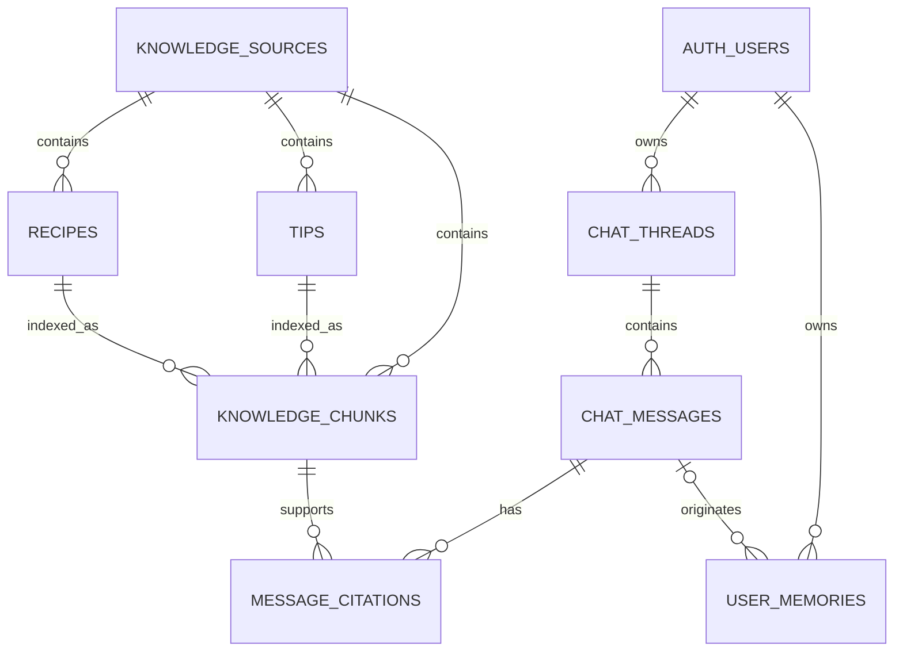

# Database Schema

Schema MVP memakai Supabase PostgreSQL sebagai source of truth untuk knowledge RAG, chat, citation, dan memory pengguna. Migration executable berada di `supabase/migrations/20260808_000001_create_rag_and_memory_schema.sql`.

## Tabel

| Tabel | Fungsi | Akses |
| --- | --- | --- |
| `knowledge_sources` | Versi sumber buku, hash, model embedding, dan publish gate | Backend service role |
| `recipes` | Resep terstruktur: bahan, langkah, hasil, kondisi target, dan status review | Backend service role |
| `tips` | Tips terstruktur: jenis tips, isi, kondisi target, dan status review | Backend service role |
| `knowledge_chunks` | Teks retrieval terpusat, relasi ke resep/tips, FTS, dan vector BGE-M3 1024 dimensi | Backend service role |
| `chat_threads` | Kepemilikan dan urutan percakapan | User pemilik + backend |
| `chat_messages` | Pesan user, assistant, dan system | User membaca/mengirim pesan user; backend menulis assistant |
| `message_citations` | Chunk dan rank retrieval yang mendasari jawaban | User pemilik membaca; backend menulis |
| `user_memories` | Memory personal terstruktur dan terkonfirmasi | User pemilik + backend |

## Relasi



## Publish Gate

Chunk hanya bisa diretrieval oleh `search_knowledge` ketika:

1. Source berstatus `published`.
2. Source sudah `approved` dan memiliki waktu review/publish.
3. Source memakai model lokal `BAAI/bge-m3` dengan dimensi 1024.
4. Chunk memiliki `medical_review_status` berupa `approved` atau `not_required`.
5. Resep/tips terkait juga sudah `approved` atau `not_required`.

Dengan demikian, file dari review queue atau konten kesehatan yang belum ditinjau tidak dapat menjadi konteks LLM secara tidak sengaja.

## Retrieval

RPC `search_knowledge` menjalankan keyword search dan cosine semantic search secara terpisah, kemudian menggabungkan rank dengan Reciprocal Rank Fusion. Filter `content_type` dan `target_condition` diterapkan di dalam query sebelum ranking. Hanya backend `service_role` yang boleh memanggil RPC ini.

Embedding hanya disimpan di `knowledge_chunks`, bukan diduplikasi pada `recipes` dan `tips`. Hasil RPC menyertakan `recipe_id`/`tip_id` serta `entity_payload`, sehingga LLM memperoleh teks relevan dan struktur resep/tips yang konsisten. Klasifikasi tips berasal dari subset hasil cleaning `health`/`nutrition` dan dipetakan saat ingest ke `care`, `feeding`, `nutrition`, atau `avoidance`.

Ingestion dan query wajib memakai model lokal serta konfigurasi pooling/normalisasi yang sama. Kontrak database menolak dimensi selain 1024.

Exact cosine search dipakai untuk koleksi awal. Tambahkan HNSW hanya setelah volume dan `EXPLAIN (ANALYZE, BUFFERS)` membuktikan perlunya approximate index.

## User Memory

- Memory baru dimulai dari status `pending`.
- Memory `active` harus dikonfirmasi user dan memiliki `confirmed_at`.
- Satu user hanya memiliki satu memory aktif untuk setiap `memory_key`.
- Referensi `source_message_id` harus berasal dari thread milik user tersebut.
- Memory personal tidak pernah masuk ke tabel atau RPC knowledge.

## Menjalankan

Setelah Supabase project untuk repo ini tersedia:

```powershell
supabase db push
psql $env:DATABASE_URL -v ON_ERROR_STOP=1 -f supabase/tests/001_rag_schema_contract.sql
```

Migration ini belum boleh diterapkan ke project `cookpal.ai`; project tersebut bukan database untuk repo IBM ini.
