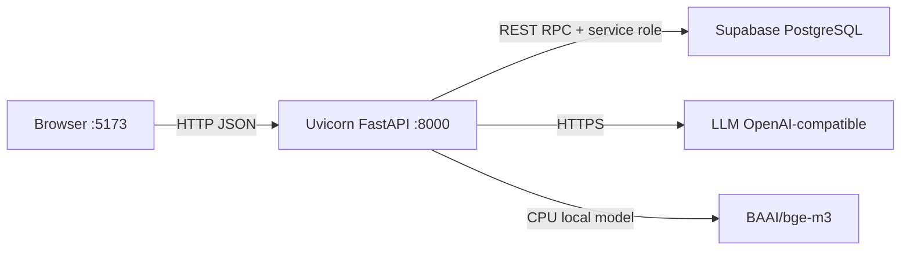

# 2. Infrastruktur

Infrastruktur menjelaskan tempat komponen berjalan, cara mereka berkomunikasi, dan batas keamanan di antara komponen tersebut.

## Saat Development

Frontend biasanya berjalan di port `5173`. Backend berjalan di port `8000`. Browser tidak boleh memanggil Supabase memakai service-role key dan tidak boleh memegang API key LLM.

## Jalur Request

1. Browser membuat `request_id` dan mengirim pertanyaan ke `POST /v1/chat`.
2. FastAPI memvalidasi bentuk request.
3. `ChatService` memeriksa cache idempotency.
4. `SafetyPolicy` memeriksa kondisi darurat dan prompt injection.
5. `IntentRouter` memilih `knowledge`, `recipe`, atau `mixed`.
6. Specialist mengambil history pendek, meminta fakta yang kurang, atau melakukan retrieval.
7. Provider Supabase mengembalikan chunk yang boleh dipakai.
8. Specialist menyusun jawaban, memeriksa safety, menambahkan citation, dan menyimpan hasil ke cache.
9. FastAPI mengirim JSON ke browser.

## Konfigurasi dan Secret

File `.env.example` adalah contoh nama variabel. File `.env` lokal berisi nilai nyata dan harus tetap di-ignore.

| Variabel | Dipakai oleh | Keterangan |
| --- | --- | --- |
| `VITE_API_URL` | Frontend | URL backend yang boleh diketahui browser |
| `VITE_SUPABASE_URL` | Konfigurasi frontend/kompatibilitas | URL project Supabase |
| `VITE_SUPABASE_ANON_KEY` | Frontend bila diperlukan | Public key, tetap gunakan RLS |
| `SUPABASE_SERVICE_ROLE_KEY` | Backend | Secret untuk operasi server dan RPC |
| `LLM_API_KEY` | Backend | Secret provider LLM |
| `LLM_BASE_URL` | Backend | Endpoint OpenAI-compatible |
| `LLM_MODEL` | Backend | Nama model |
| `CORS_ORIGIN` | Backend | Daftar origin frontend yang diizinkan |

Aturan sederhana: public key boleh masuk konfigurasi frontend sesuai desain provider, tetapi service-role key, API key model, dan `.env` tidak boleh dikirim ke browser atau commit.

## Cache Saat Ini

`InMemoryChatCache` menyimpan tiga hal:

1. history pendek berdasarkan `thread_id`;
2. agent aktif untuk melanjutkan percakapan;
3. hasil berdasarkan `request_id` untuk mencegah request ulang.

Cache memiliki TTL, batas jumlah thread, dan batas history. Karena berada di memory proses, cache hilang ketika backend restart dan tidak dibagi antar-replica.

Implikasinya:

- cocok untuk development dan satu process;
- belum cocok untuk multi-replica tanpa storage bersama;
- bukan pengganti database chat permanen;
- bukan long-term memory user;
- tidak boleh dianggap sebagai source of truth knowledge.

## Publish Gate

Data buku tidak langsung menjadi evidence hanya karena sudah di-ingest. Urutan aman adalah cleaning, validasi, review manual, ingest, approval/publication, lalu retrieval hanya terhadap record yang memenuhi status publish.

Publish gate mencegah draft, data ambigu, atau materi yang belum direview masuk ke jawaban kesehatan.

## Batas Produksi yang Harus Diingat

- Restart backend setelah mengubah source Python jika server tidak memakai reload.
- Cek `GET /health`, bukan hanya status test.
- Uji satu flow chat end-to-end setelah provider atau migration berubah.
- Jika backend memakai beberapa replica, rencanakan Redis atau storage bersama untuk state yang memang harus dibagi.
- Auth dan ownership thread harus selesai sebelum mengaktifkan memory personal yang durable.
