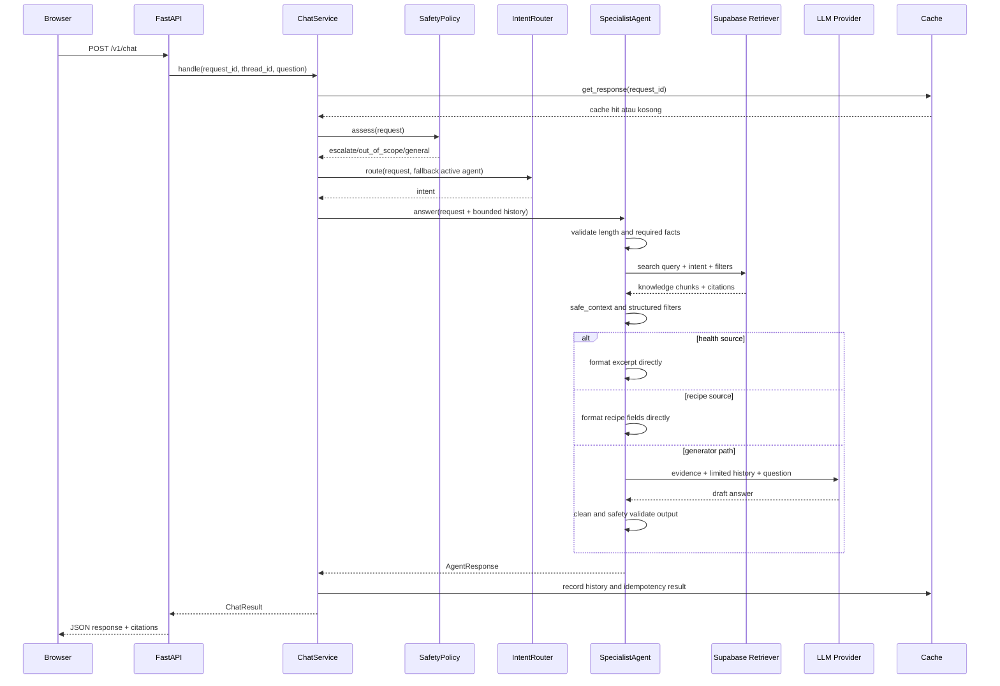

# 4. Arsitektur Agent Lengkap

Bab ini menjelaskan agent berdasarkan urutan kerja yang ada di kode. Istilah “agent” di project ini berarti workflow specialist yang memiliki policy, bukan LLM yang bebas mengambil keputusan tanpa pagar.

## Dua Specialist

### Mom

Tugas Mom adalah menangani knowledge tentang kesehatan anak ringan, parenting, dan tip yang diizinkan.

Fakta minimum yang dikumpulkan:

1. keluhan utama;
2. usia anak;
3. durasi keluhan;
4. red flag yang relevan saat screening.

Mom tidak mendiagnosis. Jika evidence kesehatan tersedia dan sudah disetujui, jalur saat ini memformat excerpt sumber secara langsung. Ini mengurangi risiko LLM menambahkan kesimpulan klinis yang tidak ada di buku.

### Koki Ben

Tugas Koki Ben adalah menangani resep dan menu anak.

Batas minimum:

1. usia anak;
2. alergi makanan;
3. bentuk sajian, misalnya makanan atau minuman;
4. kondisi target jika disebutkan.

Koki Ben memilih satu resep yang lolos filter lalu merender judul, seluruh bahan, seluruh langkah, dan catatan langsung dari data terstruktur. Ia tidak meminta LLM menulis ulang field resep.

## Urutan Eksekusi

## Tahap 1: Safety Gate

`SafetyPolicy.assess()` selalu berjalan lebih dahulu.

- Jika ada red flag seperti sulit bernapas, bibir membiru, kejang, tidak sadar, atau tidak bisa minum, intent menjadi `escalate`.
- Jika ada prompt injection seperti “abaikan instruksi” atau “system prompt”, intent menjadi `out_of_scope`.
- Jika tidak ada masalah awal, proses lanjut ke routing.

Keputusan ini sengaja deterministik. Kondisi darurat tidak boleh menunggu model bahasa.

## Tahap 2: Routing Intent

`IntentRouter` memakai aturan sederhana:

- kata seperti `resep`, `menu`, atau `makanan` mengarah ke `recipe`;
- kata kesehatan seperti `demam`, `batuk`, atau `pilek` mengarah ke `knowledge`;
- gabungan kebutuhan menghasilkan `mixed`;
- pertanyaan terlalu pendek dapat menjadi `clarify`;
- jika user sedang berada di tengah specialist, active agent dapat menjadi fallback untuk jawaban pendek.

Deterministik berarti input yang sama memberi keputusan yang dapat diperiksa. Model router baru layak ditambahkan jika evaluasi menunjukkan aturan ini tidak lagi cukup.

## Tahap 3: Required Facts

`SpecialistPolicy` menyimpan aturan milik masing-masing specialist. `next_question()` memeriksa history dan pertanyaan terbaru.

Contoh:

- Assistant bertanya usia, user menjawab `5`.
- Sistem tidak menebak apakah itu 5 tahun atau 5 bulan.
- Sistem meminta klarifikasi unit.

Ini contoh penting bahwa jawaban pendek harus ditafsirkan berdasarkan pertanyaan terakhir, tetapi unit yang berdampak pada safety tidak boleh ditebak.

## Tahap 4: Retrieval

Retriever menerima query gabungan dari pertanyaan user dan pertanyaan user sebelumnya yang masih berada dalam bounded history. Untuk resep, query juga membawa `target_condition`.

Supabase RPC menerima teks query, embedding query, jumlah hasil, filter content type, dan filter target condition.

Hasil berubah menjadi `KnowledgeChunk`, yang berisi content, similarity, content type, entity payload, dan citation.

## Tahap 5: Safe Context

Retrieval belum otomatis berarti evidence boleh dipakai. `safe_context()` menerapkan batas specialist:

- Mom hanya menerima `health`, `tip`, dan `nutrition`.
- Koki Ben hanya menerima `recipe`.
- Resep untuk usia di bawah 1 tahun ditolak oleh guardrail saat ini.
- Permintaan makanan tidak boleh memilih smoothie, jus, atau minuman.
- `target_condition` harus cocok jika tersedia.
- Resep yang mengandung allergen user dibuang.
- Koki Ben hanya menggunakan satu resep setelah filter selesai.

## Tahap 6: Penyusunan Jawaban

Ada tiga pola penyusunan:

1. Health: excerpt evidence diformat langsung dengan pengantar informasi umum.
2. Recipe: field terstruktur diformat langsung tanpa LLM.
3. Jalur generator: LLM menerima pertanyaan, bounded history, dan evidence saja; hasil kemudian dibersihkan dan divalidasi.

Pada semua pola, evidence yang tidak cukup menghasilkan abstention.

## Tahap 7: Output Safety dan Citation

Jawaban dibersihkan dari simbol yang tidak diinginkan lalu diperiksa terhadap pola kepastian klinis dan istilah berbahaya. Jika hanya sebagian kalimat yang bermasalah, kalimat tersebut dapat dibuang. Jika jawaban aman tidak tersisa, sistem meminta rewrite terarah atau mengembalikan pesan aman.

Citation berasal dari chunk yang benar-benar dipakai. Frontend kemudian menampilkan judul sumber dan halaman.

## Tahap 8: Memory dan Handoff

History saat ini adalah bounded, process-local, memiliki TTL, dan dibagi berdasarkan `thread_id`. Specialist Mom dan Koki Ben membaca history thread yang sama agar fakta tidak hilang saat domain berpindah.

Namun ini bukan memory permanen. Untuk memory durable diperlukan authentication, ownership thread, persistence, retention policy, dan kontrol privasi.

## Hubungan dengan LangChain

Konsep project ini dapat dipetakan ke istilah LangChain sebagai berikut:

| Project ini | Konsep pembelajaran LangChain |
| --- | --- |
| `AgentRequest` dan `AgentResponse` | state/message contract |
| `KnowledgeRetriever` | retriever/tool interface |
| `AnswerGenerator` | chat model interface |
| `ChatService` | deterministic orchestration |
| `SpecialistPolicy` | agent instructions dan guardrails |
| `InMemoryChatCache` | short-term state/checkpoint concept |
| urutan gate dan filter | graph nodes/edges atau middleware |

Pelajari [LangChain agents](https://docs.langchain.com/oss/python/langchain/agents) untuk agent loop dan tools. Pelajari [LangGraph](https://docs.langchain.com/oss/python/langgraph/overview) ketika membutuhkan graph stateful, persistence, streaming, durable execution, atau human-in-the-loop. Project ini belum memerlukan perubahan tersebut untuk menjelaskan workflow dasarnya.
