# 5. Alur RAG dan Data

RAG berarti Retrieval-Augmented Generation: model tidak menjawab hanya dari pengetahuan parametrisnya, tetapi diberi potongan sumber yang ditemukan dari knowledge base.

## Alur Data Buku

```mermaid
flowchart LR
    Raw[Markdown buku] --> Clean[Cleaning]
    Clean --> Validate[Validation]
    Validate --> Review[Manual review]
    Review --> Ingest[Ingest idempotent]
    Ingest --> Embed[Embedding BGE-M3]
    Embed --> DB[knowledge_chunks]
    DB --> RPC[search_knowledge]
    RPC --> Agent[Specialist agent]
    Agent --> Citation[Jawaban + citation]
```

## Mengapa Ada Chunk?

Buku panjang tidak dikirim seluruhnya ke model. Isi dipecah menjadi chunk yang cukup kecil untuk dicari dan cukup lengkap untuk dipahami.

Setiap chunk idealnya memiliki content, source title dan halaman, content type, embedding, status review/publication, serta relasi ke recipe atau tip jika ada.

## Cara Retrieval Bekerja

RPC `search_knowledge` menggabungkan pencarian keyword dan semantic vector search. Ranking digabung menggunakan Reciprocal Rank Fusion. Filter content type dan target condition diterapkan sebelum hasil dipakai agent.

Hal yang harus konsisten:

- model embedding pada ingest dan query;
- dimensi vector, yaitu 1024;
- normalisasi vector;
- status publish;
- filter domain specialist.

Jika salah satu berbeda, hasil retrieval dapat terlihat kosong atau tidak relevan walaupun data sebenarnya ada.

## Retrieval Kosong Bukan Satu-satunya Kegagalan

Saat jawaban fallback muncul, periksa empat kemungkinan secara terpisah:

1. provider retrieval tidak tersedia;
2. retrieval berjalan tetapi hasilnya kosong;
3. evidence ada tetapi generator gagal;
4. draft ada tetapi ditolak safety validator.

Kesalahan diagnosis yang umum adalah langsung menyimpulkan “data tidak ada” hanya karena user melihat fallback.

## Health Berbeda dari Recipe

Health adalah informasi umum yang berisiko berubah menjadi diagnosis jika ditulis ulang secara bebas. Karena itu jalur saat ini merender excerpt yang sudah direview secara langsung.

Recipe memiliki struktur bahan dan langkah yang harus dipertahankan. Karena itu Koki Ben merender field terstruktur dan abstain jika bahan atau langkah tidak lengkap.

## Citation sebagai Bukti

Citation menjawab pertanyaan: “Jawaban ini berasal dari sumber yang mana?”

Citation membantu reviewer memeriksa evidence, debugging membedakan retrieval dari generation, user memahami batas jawaban, dan sistem menjaga traceability.

## Publish Gate sebagai Pagar

Konten kesehatan yang belum direview tidak boleh menjadi context LLM. Status `draft` atau `pending` harus berhenti sebelum tahap retrieval publik.

Urutan belajar yang baik adalah memahami schema di [docs/database-schema.md](../database-schema.md), lalu pipeline di [docs/data-ingestion.md](../data-ingestion.md), baru membaca adapter retrieval di `backend/app/infrastructure/providers.py`.
