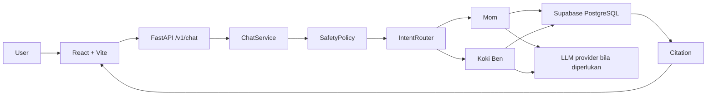

# Panduan Belajar Project IBM

Dokumen ini adalah panduan belajar untuk memahami project Teman Tumbuh dari dasar sampai alur agent yang lengkap. Bahasa dibuat sederhana, tetapi penjelasannya mengikuti struktur kode yang benar-benar ada di repository.

## Tujuan Belajar

Setelah membaca folder ini, pembaca diharapkan dapat:

1. Menjelaskan fungsi setiap teknologi yang dipakai.
2. Mengikuti perjalanan satu pertanyaan dari browser sampai menjadi jawaban.
3. Menjelaskan perbedaan frontend, API, application layer, domain, infrastructure, dan database.
4. Menjelaskan cara kerja dua specialist agent: Mom dan Koki Ben.
5. Memahami mengapa safety, retrieval, citation, dan publish gate penting untuk aplikasi kesehatan anak.
6. Mengenali kesalahan yang pernah terjadi dan aturan untuk mencegah regresinya.

## Cara Membaca

Baca dokumen dalam urutan berikut:

1. [Tech stack](01-tech-stack.md)
2. [Infrastruktur](02-infrastruktur.md)
3. [Struktur project](03-struktur-project.md)
4. [Arsitektur agent lengkap](04-arsitektur-agent.md)
5. [Alur RAG dan data](05-alur-rag.md)
6. [Pelajaran dari revisi](06-pelajaran-dari-revisi.md)
7. [Praktikum dan verifikasi](07-praktikum.md)

## Gambaran Besar

## Ide Utama

Project ini bukan sekadar chatbot. Ia adalah sistem yang membatasi jawaban berdasarkan beberapa pagar:

- pertanyaan harus berada dalam scope parenting, kesehatan anak ringan, atau resep;
- kondisi darurat harus diarahkan ke bantuan medis sebelum retrieval atau LLM;
- jawaban kesehatan harus berangkat dari evidence yang sudah dipublikasikan;
- resep harus mempertahankan struktur bahan, langkah, usia, bentuk sajian, dan alergi;
- setiap jawaban yang memakai sumber perlu membawa citation;
- jika evidence tidak cukup, sistem harus abstain, bukan menebak.

## Catatan tentang LangChain

Repository ini saat ini memakai workflow Python buatan sendiri yang deterministik. `backend/app/application/chat.py`, `router.py`, `safety.py`, dan `agent.py` mengatur urutan kerja secara eksplisit. LangChain belum tercantum di `backend/requirements.txt`.

Untuk mempelajari konsep agent modern yang berkaitan dengan project ini, baca dokumentasi resmi berikut:

- [LangChain overview](https://docs.langchain.com/oss/python/langchain/overview)
- [LangChain agents](https://docs.langchain.com/oss/python/langchain/agents)
- [LangGraph overview](https://docs.langchain.com/oss/python/langgraph/overview)
- [LangChain models](https://docs.langchain.com/oss/python/langchain/models)

Gunakan dokumentasi tersebut untuk belajar model, tools, agent loop, graph, middleware, persistence, dan tracing. Jangan memasukkan LangChain hanya karena sedang populer; perubahan itu baru masuk akal setelah workflow sekarang memiliki kebutuhan yang tidak lagi nyaman dikelola secara eksplisit.
