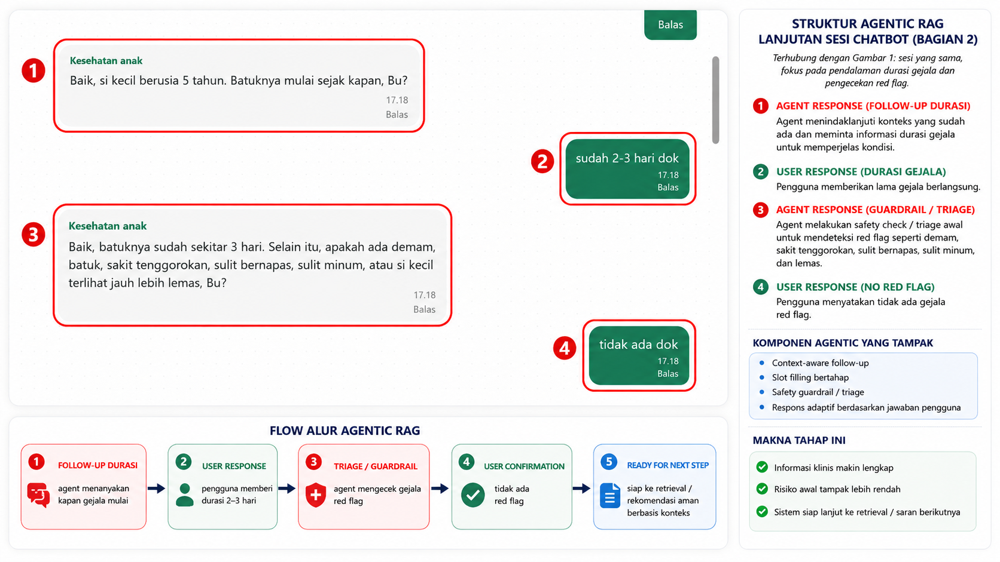
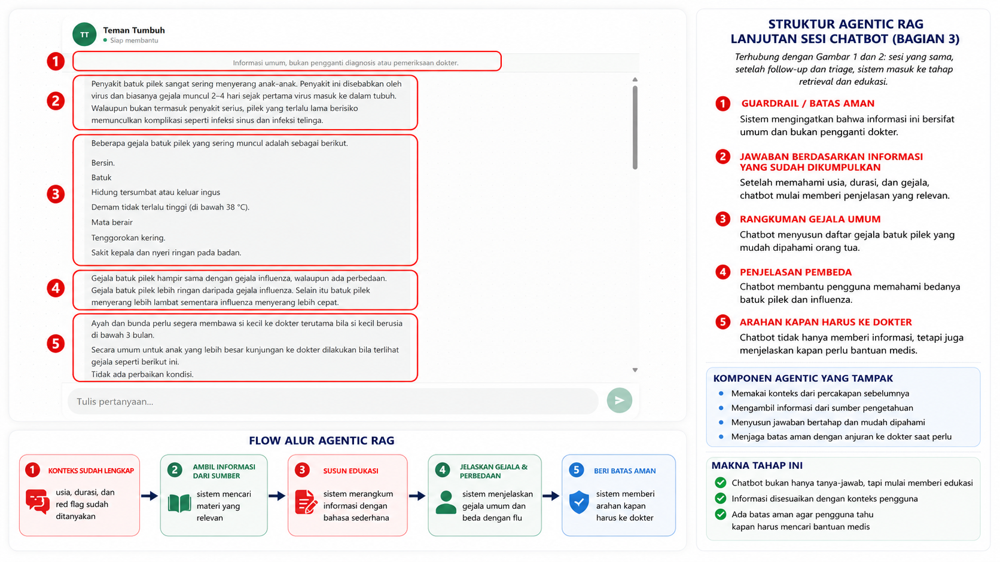
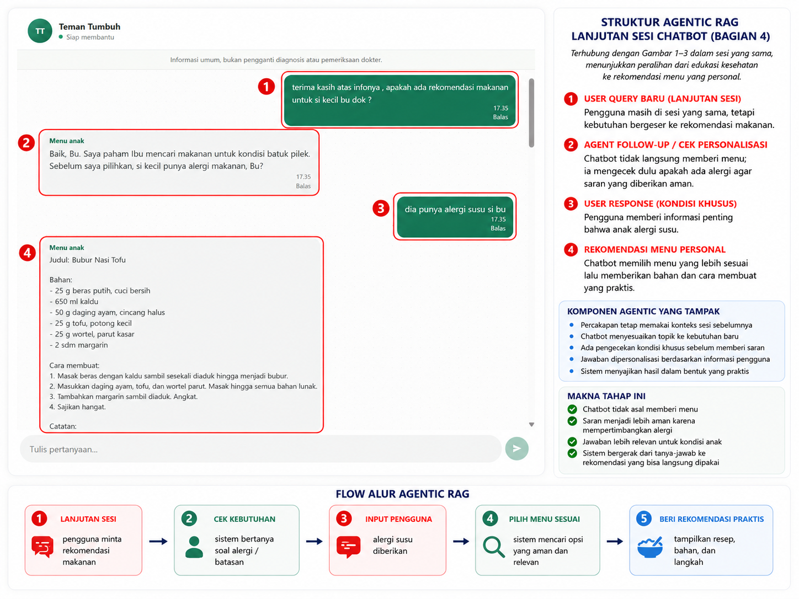

# Dokumentasi Demo Visual

Empat gambar ini menunjukkan satu sesi Teman Tumbuh secara berurutan. Alurnya bergerak dari pengumpulan konteks, pemeriksaan risiko, edukasi berbasis sumber, sampai rekomendasi makanan yang dipersonalisasi.

## Pic 1: Pembukaan dan Pengumpulan Konteks

Gambar pertama memperlihatkan awal percakapan:

- Sistem menyampaikan pesan pembuka dan batasan bahwa informasi bukan pengganti diagnosis atau pemeriksaan dokter.
- Pengguna menyampaikan keluhan anak batuk pilek.
- Agen menanyakan usia anak, kemudian menanyakan durasi gejala.
- Diagram sebelah kanan dan bagian bawah menjelaskan pola `welcome -> user query -> follow-up -> information complete -> retrieval -> response/triage`.

## Pic 2: Follow-up Durasi dan Triage Awal

Gambar kedua melanjutkan percakapan dengan fokus pada durasi dan red flag:

- Agen mengonfirmasi bahwa batuk berlangsung sekitar 2-3 hari.
- Agen memeriksa demam, sakit tenggorokan, kesulitan bernapas, kesulitan minum, dan kondisi lemas.
- Pengguna menjawab bahwa tidak ada gejala red flag.
- Setelah informasi cukup dan risiko awal lebih rendah, sistem siap melanjutkan ke pencarian pengetahuan atau saran yang aman.

## Pic 3: Edukasi Berbasis Sumber dan Batas Aman

Gambar ketiga memperlihatkan hasil retrieval dan penyusunan jawaban:

- Sistem tetap menampilkan batasan informasi umum dan bukan pengganti dokter.
- Agen menjelaskan batuk pilek, penyebab umum, serta gejala yang sering muncul.
- Agen membedakan batuk pilek dari influenza secara sederhana.
- Agen memberi arahan kapan anak perlu dibawa ke dokter.
- Tahap ini menunjukkan bahwa jawaban dibuat setelah konteks usia, durasi, dan triage terkumpul.

## Pic 4: Peralihan ke Rekomendasi Menu

Gambar keempat menunjukkan perubahan kebutuhan dalam sesi yang sama:

- Pengguna meminta rekomendasi makanan untuk anak.
- Agen tidak langsung memberi menu, tetapi memeriksa alergi makanan terlebih dahulu.
- Pengguna menyebutkan alergi susu.
- Agen memberikan menu bubur nasi tofu beserta bahan dan cara membuat yang disesuaikan dengan kondisi tersebut.
- Diagram bawah merangkum alur `permintaan menu -> cek batasan -> input alergi -> pilih menu -> rekomendasi praktis`.

## Cara Menampilkan Gambar di GitHub

Gambar harus berada di repository dan ikut dalam commit. Folder `brain/` tetap di-ignore untuk menjaga file internal, tetapi empat PNG pada `brain/file-pics/` diberi pengecualian agar dapat ditampilkan oleh GitHub. Setelah perubahan di-push, buka README pada branch `main`; gambar akan dirender otomatis.
